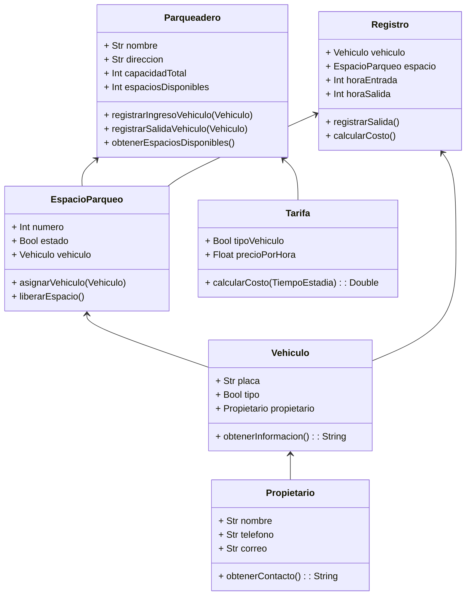

# reto_2
Elija un problema de la vida real (sistema de gestión de biblioteca, negocio de compra-venta, automóvil, etc) que se pueda modelar a través de objetos y clases. Plantee las relaciones de clases, composiciones, propiedades y comportamientos del sistema en uno mas diagramas tipo UML.
## Problema a analizar
Para desarrollar este reto, decidí modelar un sistema de gestión para un parqueadero. A continuación, presento el diagrama de clases correspondiente, que refleja las relaciones entre las distintas clases.

Este modelo permite reflejar cómo la clase principal, que es Parqueadero, interactúa con las demás clases que le permiten realizar sus operaciones, entre las cuales se incluyen manejar los espacios y la entrada y salida de vehículos.
